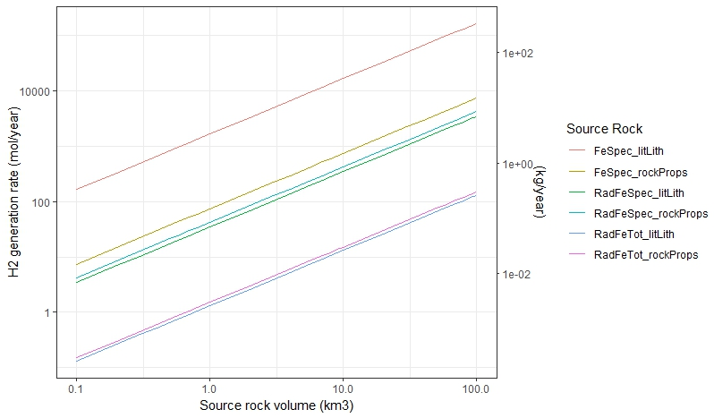
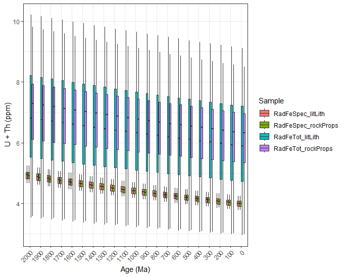

--- 
title: 'LithoGas: Monte Carlo model for estimating H2 and He production through radiolysis and serpentinization'
tags:
  - R
  - geology
  - hydrogen
  - helium

authors:
  - name: Daniel S. Coutts
    corresponding: true 
    affiliation: 1
  - name: Oliver Warr
    affiliation: 2
  - name: Omid H. Ardakani
    affiliation: 1
  - name: Barbara Sherwood Lollar
    affiliation: 3

affiliations:
 - name: Natural Resources Canada - Geological Survey of Canada - Calgary
   index: 1
 - name: University of Ottawa, Canada
   index: 2
 - name: University of Toronto, Canada
   index: 3
date: August 12, 2025
bibliography: paper.bib
--- 

# Summary

Naturally occurring hydrogen (H2) in the Earth's subsurface represents a novel source of H2 for use in electricity generation and hard-to-abate industrial processes (e.g., ammonia, fertilizer, steel) [@IEA:2024; @Ballentine:2025; @Johnson:2025; @SherwoodLollar:2025]. Helium (He), meanwhile, is a critical non-renewable resource utilized in medical, industrial, and research fields [@Warr:2019; @Danabalan:2022; @Cheng:2023]. With a growing list of H2 and He showings in different geological settings [@SherwoodLollar:2014; @Danabalan:2022; @Miaga:2023; @Truche:2024] along with focused exploration for these gases [@Jackson:2024; @Ballentine:2025; @Hu:2025], new tools are required to prospect for and model these emerging resources. Natural H2 is produced through two dominant geologic processes [@SherwoodLollar:2014; @Ballentine:2025]: radiolysis [@Lin:2005; @Warr:2023; @Higgins:2025] and serpentinization [@Coveney:1987]. Radiolytic H2 is generated when ionizing α, β, and γ particles from U, Th, and K-bearing minerals break water into H2 and O ions. It is important to note that released alpha particles are equivalent to helium-4 atoms, and the breakdown of U and Th-bearing minerals is a dominant process for the generation of helium in the subsurface. H2 formation through serpentinization requires the release of H2 due to the oxidation state change of Fe2+ to Fe3+ in different mineral reaction in the presence of water (e.g., olivine to serpentine) [@SherwoodLollar:2014; @Ballentine:2025]. Current modelling of these processes is not accessible or focused on economic assessment of potential resources. To partially fill this gap in resource estimation tools, LithoGas provides fast and efficient Monte Carlo modelling of H2 and He production rates, following the radiolysis quantification methods of @Warr:2023 and serpentinization methods of @Ardakani:2026. This implementation provides a rapid pathway to digest a large numbers of lithogeochemical samples to understand their H2 and/or He prospectivity over geological time scales, and to scale production rates to economically relevant source rock volumes.

# Statement of Need

New resource modelling tools are urgently required to explore for He and natural H2, given their emerging and critical role in low-carbon energy generation and in research, medical, and industrial processes [@Danabalan:2022; @Jackson:2024; @IEA:2024; @SherwoodLollar:2025]. LithoGas addresses this need by: 1) calculating H2 and He production rates via radiolysis and serpentinization from rock geochemical and physical properties; 2) back-projecting these generation rates into deep time to estimate cumulative production; 3) summarising and plotting results, including novel source-rock-volume-scaling plots focused on resource estimation metrics. These functions provide the foundation for basin-scale modelling of radiolysis- and serpentinization-dominated H2 systems, analogous to exploration workflows for conventional hydrocarbon systems.
The Monte Carlo approach (monteProd()) follows the equations of [@Warr:2023] and [@Ardakani:2026], incorporating truncated normal distributions (controlled by min/max/mean/standard deviation parameters) for sample geochemistry (Fe, U, Th, and K concentrations), physical rock properties (rock density and porosity), and fluid properties (fluid density) (Table 1). Two pathways are available for assigning rock physical properties: user-defined sample-specific distributions, or automatic lookup from The Canadian Rock Physical Property Database [@Enkin:2018] based on the known lithology. If a deterministic rather than probabilistic model is desired, the standard deviation of any model parameter can be set to zero. Serpentinization H2 production can be modelled via two methods [@Ardakani:2026] depending on data availability: an iron speciation approach using measured Fe2O3 and FeO concentrations (monteSerpFeSpecies()), or a total iron approach using bulk Fe2O3T where speciation data are unavailable (monteSerpFeTotal()). Both serpentinization methods use the change in Fe³⁺/FeT ratio between initial and current states to estimate magnetite (Fe3O4) production and the associated stoichiometric H2 yield.
Monte Carlo results from multiple samples are summarised using monteSum(), which collapses the full trial distribution to minimum, mean, and maximum production rates per sample group. Source rock volume scaling plots are generated by monteH2Plot() and monteHePlot(), which scale per m³ production rates across a range of source rock volumes (0.1 to 100 km³), producing log-log plots that allow direct comparison of H2 and He prospectivity across samples and lithologies. These source rock volume scaling plots are a simple yet important development, allowing prospecting for natural H2 and He from abundant lithogeochemical samples. A secondary axis on both plots converts molar production rates (mol/year for specified source rock volume) to mass rates (kg/year for specified source rock volume) for direct economic interpretation.
Lastly, production rates produced by monteProd() can be projected into deep time wit the deepTimeProd() function. For radiolysis, U, Th, and K concentrations are back calculated using radioactive decay law. For serpentinization, and average rate of serpentinization is applied. These can the then be used by the user to look at cumulative volumes produced over time.

# Conclusion

Overall, LithoGas provides a straightforward workflow for modelling multiple samples from a single structured input dataframe through to publication-ready summaries and plots that inform exploration. Functions include: 1) performing the Monte Carlo modelling via monteProd(), ingesting data as a structured dataframe (Table 1); 2) summarising Monte Carlo results via monteSum() and plotting novel source-volume-scaling plots via monteH2Plot() and monteHePlot() (Figure 1). Example datasets include dataframes structured for Monte Carlo model input with and without known rock properties (structuredDF) and the summarised lithology distributions from The Canadian Rock Physical Property Database (CRPPData). 

#### Table 1: Example layout of structured dataframe required for input into Radiolysis monteProd() function. The function data from the input dataframe by column name (e.g., $uMin, $rockDenMax), as such column names must match exactly. 

|Dataframe column | Type        | Description                                                                                            |
|:------------------------:|:-----------:|:-----------------------------------------------------------------------:|
|Sample | Numeric | Sample name |
|uMin |Numeric|Minimum of modelled uranium concentration distribution (ppm)|
|uMax |Numeric|Maximum of modelled uranium concentration distribution (ppm)|
|uMean|Numeric|Mean of modelled uranium concentration distribution (ppm)|
|uSD|Numeric|Standard deviation of modelled uranium concentration distribution (ppm)|
|thMin |Numeric|Minimum of modelled thorium concentration distribution (ppm)|
|thMax |Numeric|Maximum of modelled thorium concentration distribution (ppm)|
|thMean|Numeric|Mean of modelled thorium concentration distribution (ppm)|
|thSD|Numeric|Standard deviation of modelled thorium concentration distribution (ppm)|
|kMin |Numeric|Minimum of modelled potassium concentration distribution (wt%)|
|kMax |Numeric|Maximum of modelled potassium concentration distribution (wt%)|
|kMean|Numeric|Mean of modelled potassium concentration distribution (wt%)|
|kSD|Numeric|Standard deviation of modelled potassium concentration distribution (wt5)|
|fluDenMin |Numeric|Minimum of modelled fluid density distribution (g/cm3)|
|fluDenMax |Numeric|Maximum of modelled fluid density distribution (g/cm3)|
|fluDenMean|Numeric|Mean of modelled fluid density distribution (g/cm3)|
|fluDenSD|Numeric|Standard deviation of modelled fluid density distribution (g/cm3)|
lithLith|String|Lithologiy/category of desired rock properties from Canadian Rock Physical Property Database|
|rockDenMin |Numeric|Minimum of modelled rock density distribution (g/cm3)|
|rockDenMax |Numeric|Maximum of modelled rock density distribution (g/cm3)|
|rockDenMean|Numeric|Mean of modelled rock density distribution (g/cm3)|
|rockDenSD|Numeric|Standard deviation of modelled rock density distribution (g/cm3)|
|porMin |Numeric|Minimum of modelled grain porosity distribution (decimal fraction)|
|porMax |Numeric|Maximum of modelled grain porosity distribution (decimal fraction)|
|porMean|Numeric|Mean of modelled grain porosity distribution (decimal fraction)|
|porSD|Numeric|Standard deviation of grain porosity distribution (decimal fraction)|

# Figures

